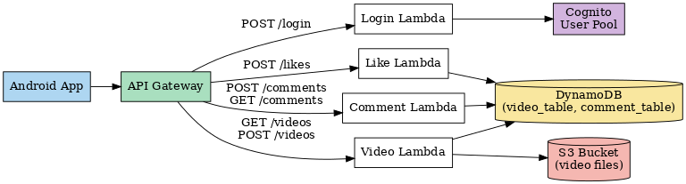

# Short Video Android App (Jetpack Compose + AWS Serverless Backend)

This is a short video mobile application developed using **Jetpack Compose** and **MVVM** architecture.  
The app connects to a fully serverless backend hosted on **AWS**, providing video streaming, commenting, like, and user login features.

Demo: https://youtu.be/X8iMGItB2pw  
Back-end repo: https://github.com/ZhanLuo2024/shortvideo-backend.git  

## Features

- **Home Screen**:
    - Displays short videos in a vertical feed.
    - Auto-play video playback.
    - Supports like and comment actions.

- **Comment Screen**:
    - View and post comments for each video.

- **Discover Screen**:
    - Grid layout for exploring available videos.

- **Publish Screen**:
    - Upload new videos.
    - Recording feature implemented, but emulator limitations prevent camera access. Upload logic is fully functional.

- **User Center**:
    - Shows user profile and personal video stats.
    - AWS Cognito login integration (real authentication, not mock).

- **AWS Backend Integration**:
    - **Videos** and **comments** stored in **DynamoDB**.
    - Video files stored in **S3**.
    - Like and comment actions connected to **Lambda** APIs.
    - User login verified with **Cognito** using a secure authentication flow.

## Tech Stack

### Frontend (Android)
- **Kotlin** 2.0.21
- **Jetpack Compose** UI
- **Media3** (ExoPlayer) for video playback
- **Coil** for image loading
- **Retrofit2** for video, comment, and like APIs
- **Ktor Client** for login API (Cognito authentication)
- **Jetpack Navigation Compose** for screen transitions
- **StateFlow** and **mutableStateOf** for state management

### Backend (AWS)
- **API Gateway**: Manages API endpoints
- **Lambda** Functions: Handles video, comments, likes, and login logic
- **DynamoDB**: Stores video metadata and comments
- **S3 Bucket**: Stores video files
- **Cognito User Pool**: User authentication
- **AWS CDK**: Infrastructure as code to automate backend deployment

## Architecture

The app follows the **MVVM (Model-View-ViewModel)** pattern:
- **Model**:
    - `Video.kt`
    - `Comment.kt`
- **ViewModel**:
    - `HomeViewModel`: Loads video data.
    - `CommentViewModel`: Handles loading and posting comments.
    - `DiscoverViewModel`: Manages the Discover page videos.
    - `SharedUiViewModel`: Manages login status and tab visibility.
- **View**:
    - Composable UI screens.

### Class Diagram

！[Class diagram](images/ClassDesign.drawio.png)

### AWS Serverless Architecture Diagram

### Emulator Limitation
The Publish screen includes camera recording functionality, but due to Android emulator restrictions, video capture does not work in the emulator environment.
However, the upload logic has been fully implemented and tested using simulated data.  

### How to Run
- Clone the repository
- Set up an emulator or connect a physical Android device
- Build and run the app

### Development Notes
- All backend APIs were tested using Postman before integrating into the app.
- The AWS CDK was used to deploy and update backend resources automatically.
- AWS IAM policies were carefully configured to give Lambda functions access to DynamoDB, S3, and Cognito without over-permission.

## License

This project was developed as part of an academic assignment and is not intended for commercial use.

